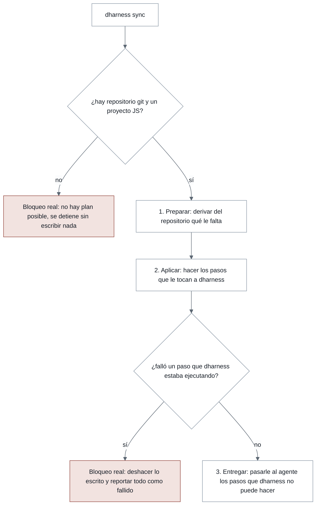
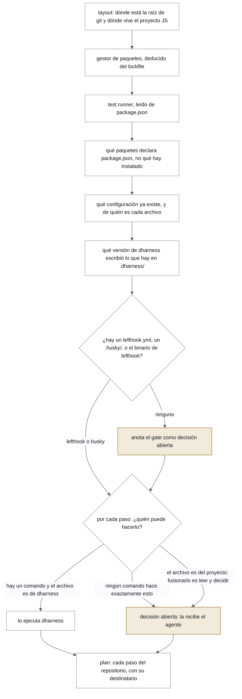
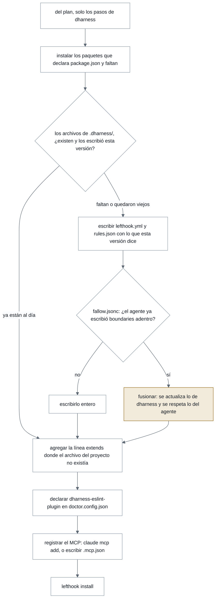
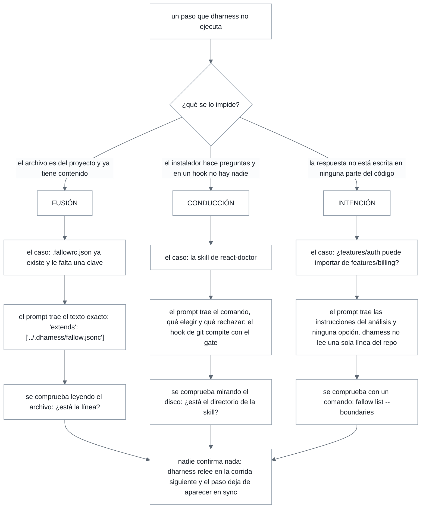
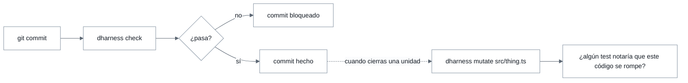
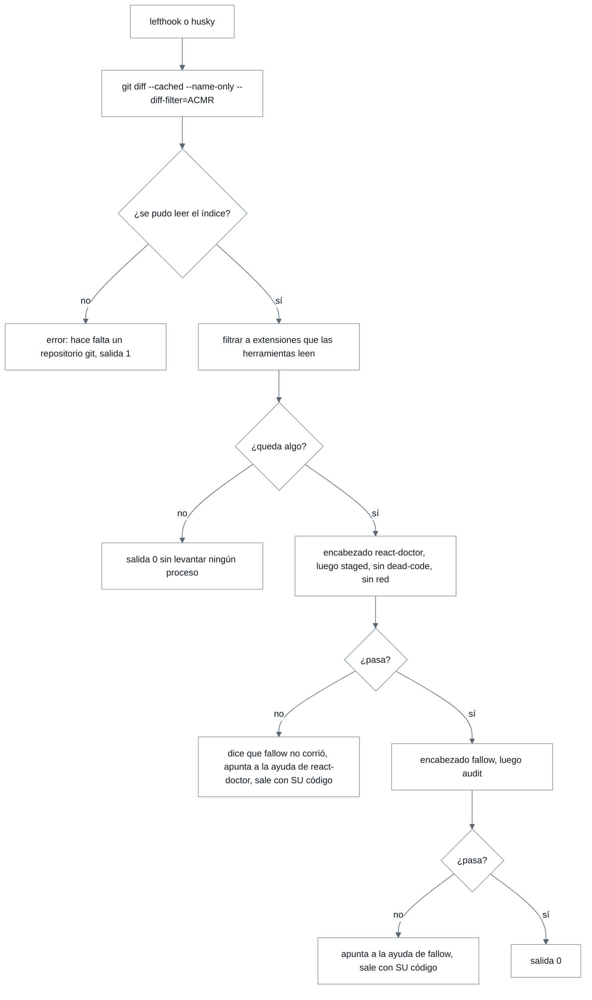
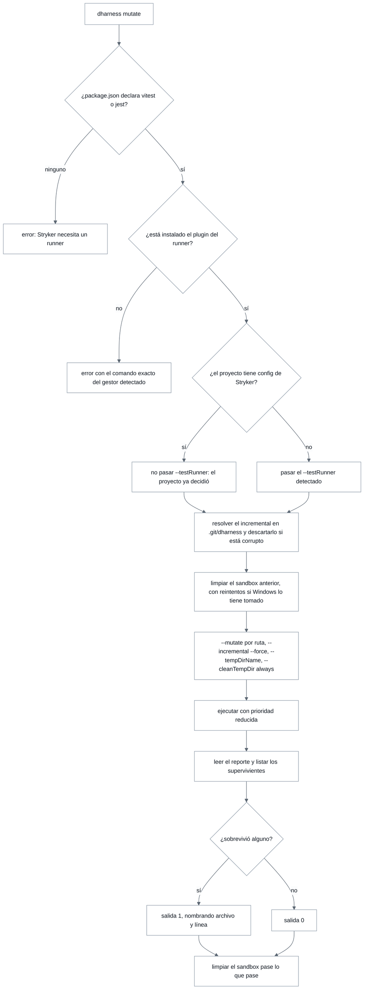

# dharness — Flujo implementado

> Espejo en markdown del artifact publicado. Si los dos discrepan, gana este
> archivo, porque es el que viaja con el código.
>
> Complemento: [`design-principles.md`](./design-principles.md) y
> [`learning-log.md`](./learning-log.md).

## Lo que hace hoy el binario

Cuatro comandos sobre tres librerías. Este documento describe el código que
existe y compila, no el diseño previsto.

- **Fecha:** 9 de agosto de 2026
- **Comandos:** sync · check · mutate · version
- **Verificado ejecutando:** react-doctor 0.9.11 · fallow 3.x

---

## Nomenclatura — un directorio propio y una línea ajena

Todo lo que dharness escribe vive en `.dharness/`, se commitea, y lleva el
nombre de la herramienta cuyo formato contiene. Del archivo del proyecto se toca
una sola línea.

| Herramienta | ¿Compone? | Archivo de dharness | Qué se toca del proyecto |
| --- | --- | --- | --- |
| lefthook | `extends` — verificado | `.dharness/lefthook.yml` | Una línea `extends`, o el archivo entero si no existía |
| fallow | `extends` — verificado | `.dharness/fallow.jsonc` | Una línea `extends`, o el archivo entero si no existía |
| husky | Es un script | — | Una línea anexada a `.husky/pre-commit` |
| react-doctor | No compone | — | Fusión de datos en `doctor.config.json`, que es JSON |
| dharness-eslint-plugin | Es un paquete, no un archivo | `.dharness/rules.json` | Una entrada en `plugins` y sus reglas en `rules` |

La regla que sale de ahí es corta: **donde la herramienta sabe componer,
dharness escribe su propio archivo y agrega una referencia; donde no, fusiona
datos.** Y cuando el archivo del proyecto no es datos sino código —un
`doctor.config.ts`, por ejemplo— no se fusiona, se describe.

El efecto secundario que más me gusta es que le da al modelo un solo lugar donde
escribir: la arquitectura se declara en `.dharness/fallow.jsonc`, sin tocar el
`.fallowrc.json` del proyecto.

### Y resuelve el límite de las reglas propias

La severidad de react-doctor solo acepta `error`, `warn` u `off`:
`["error", 500]` se rechaza con *«must be one of: error, warn, off»*, y
`context.options` llega vacío. Eso dejaba los umbrales —las 500 líneas por
archivo— escritos a fuego dentro del plugin.

Con el directorio ya definido, el plugin lee sus umbrales de
`.dharness/rules.json`. El límite deja de ser una constante compilada y pasa a
ser un archivo del repositorio, versionado junto al resto y distinto por
proyecto sin republicar el paquete.

```
.dharness/
  .gitignore       # ignora todo salvo lo nombrado abajo
  lefthook.yml     # el gate
  fallow.jsonc     # arquitectura: zonas o preset
  rules.json       # umbrales de las reglas propias
  evidence.json    # hechos medidos, no progreso
  stryker-tmp/     # sandbox de la corrida, ignorado

.git/dharness/     # estado del repositorio: nunca se commitea
  stryker-incremental.json
```

### Tres destinos, no uno

Lo que describe al repositorio se commitea. Lo transitorio se ignora sin pedirle
nada al `.gitignore` del proyecto: el directorio trae el suyo, con la forma que
usa CodeGraph —ignorar todo y nombrar las excepciones— de modo que un archivo
nuevo queda ignorado por defecto y uno que deba compartirse hay que declararlo.

Y el estado del repositorio va al **directorio común de git**. Es el único lugar
que reúne las tres propiedades que hacen falta: git ya lo ignora, los worktrees
del mismo repositorio lo comparten, y borrar el repositorio se lo lleva con él.
Antes eso vivía en un directorio de caché del sistema con la ruta hasheada, que
deja estado huérfano para siempre la primera vez que un repositorio se mueve.

---

## Adopción y actualización — dentro de `dharness sync`

Un solo comando. Adoptar un repositorio y ponerlo al día son la misma operación
mirada en dos momentos distintos: en los dos casos se deriva qué le falta a este
repositorio y se hace realidad lo que se pueda. No hay un comando de instalación
y otro de mantenimiento.

Tiene tres fases, y solo dos puntos en los que se detiene.



**Figura 1.** Las tres fases, y las dos únicas cajas rojas de todo el comando.
Preparar no escribe, así que no puede fallar; Aplicar sí, y por eso es la única
que tiene con qué romperse.

> **La caja izquierda dibuja dos estados como uno solo, a propósito.** No hay
> repositorio git y no hay proyecto que adoptar terminan en el mismo resultado
> —ningún plan posible, nada escrito— pero no en el mismo código de salida. Sin
> repositorio no hay nada que dharness pueda hacer en ningún lado: sale con
> error, salida 1. Sin proyecto JS el repositorio es real y la respuesta
> honesta es «esto no es un proyecto que dharness sepa adoptar»: sale 0, con el
> mismo mensaje que `noSourceMessage` imprimía antes de este cambio. §17 pone
> el veredicto en el código de salida, y «acá no hay nada para mí» no es un
> fallo.

### 1. Preparar: de dónde sale el plan



**Figura 2.** Nada de esto escribe, así que nada de esto puede fallar. La última
fila de detección es la que hace que este comando también sirva para actualizar:
mira qué versión de dharness escribió los archivos propios.

### Qué es el plan

El plan es **la lista de pasos que este repositorio necesita, cada uno con su
destinatario**: los que ejecuta dharness y los que quedan como decisión abierta.
Nada más.

No se guarda en ningún archivo. Se vuelve a derivar del repositorio en cada
corrida, y eso es lo que hace que un solo comando alcance: un paso que alguien
deshizo a mano reaparece solo, y uno que ya está hecho desaparece sin que nadie
lleve la cuenta. Correrlo por segunda vez no repite nada, porque lo hecho ya no
está en el plan.

Por eso cada paso necesita una pregunta que se pueda contestar *sin ejecutar
nada*: preparar no escribe, así que no puede averiguar si falta un paquete
instalándolo. Y esa pregunta se le hace siempre a lo que el proyecto
**declara**, nunca a lo que quedó instalado. Un `node_modules` es el resultado
de una instalación, no una decisión del repositorio: está vacío en un clon
recién hecho, y no existe en absoluto bajo Yarn PnP. Un paso que se pregunta por
él reporta trabajo pendiente que nadie tiene que hacer, y bajo PnP no puede
darse por satisfecho nunca — con lo cual `sync` pierde su estado terminal, que
es justamente su razón de ser.

### 2. Aplicar: solo lo que le toca a dharness



**Figura 3.** Cada archivo queda fotografiado antes de tocarlo, y por eso esta
fase se puede deshacer entera. La rama ámbar es la única excepción a reescribir:
`fallow.jsonc` es de dharness, pero los `boundaries` de adentro los puso el
agente, así que ahí se fusiona.

### Por qué la skill no se puede ejecutar

Corrí `react-doctor install --dry-run --yes` para no suponerlo. Escribiría cinco
cosas, no una: skills en **veintiséis** agentes, un script en `package.json`, la
dependencia de desarrollo, un hook directo en `.git/hooks/pre-commit` —que choca
con el gate— y un workflow en `.github/workflows/`.

Y su `--help` no ofrece ninguna forma de elegir solo la skill ni un solo agente:
los flags son `-y`, `--dry-run`, `--agent-hooks` y `--cwd`. O es interactivo, o
hace las cinco. Por eso se delega con una instrucción acotada, no con un
encogimiento de hombros: correr el comando, elegir la skill, rechazar el hook y
el workflow.

### El gestor de hooks se prueba, no se supone

Escribir un `lefthook.yml` no instala lefthook: el hook de git no existe hasta
correr `lefthook install`. Y en un proyecto con husky ese archivo no lo lee
nadie. El criterio es el mismo con el que el repositorio de referencia decide si
una máquina Linux es usable: lo que la habilita es un gestor que contesta, no la
pertenencia a una lista que alguien tiene que mantener.

| Lo que responde | Qué hace `sync` |
| --- | --- |
| lefthook | Escribe `.dharness/lefthook.yml`, agrega el `extends` y corre `lefthook install` |
| husky | Anexa la línea a `.husky/pre-commit` |
| ninguno | Lo anota como decisión abierta y sigue con el resto. Elegir gestor de hooks no es un default que dharness deba imponer |

### Quién termina haciendo cada paso

Cada paso se queda en el primero de estos dos que puede con él:

- **dharness**, cuando hay un comando que hace exactamente eso, o cuando el
  archivo es suyo. Corre `lefthook install`, y escribe `.dharness/lefthook.yml`
  porque ese archivo lo inventó él.
- **El agente**, cuando no. Recibe la instrucción y la ejecuta.

Y no hay un tercero. El cliente de dharness es el agente, no la persona que está
detrás: el agente es quien programa, y lo que recibe son instrucciones que puede
ejecutar. Si un paso necesita algo que solo una persona sabe —por ejemplo si
`features/auth` tiene permitido importar de `features/billing`—, es el agente
quien decide si preguntarlo. Esa conversación no pasa por dharness.

**Que le toque al agente no es un fallo.** Que el `.fallowrc.json` del proyecto ya
exista significa que ese repositorio configuró fallow a propósito, no que
dharness no pueda instalarse: escribe igual lo suyo, anota la línea que falta, y
sigue. Agregar una clave a un JSON ajeno es leerlo y decidir, que es exactamente
el trabajo del agente. Y el gate corre sin esa línea, así que nada de lo que
viene después depende de ella.

| Situación | Qué hace `sync` | ¿Detiene? |
| --- | --- | --- |
| `.fallowrc.json` ya existe con configuración propia | Escribe `.dharness/fallow.jsonc` igual y le entrega al agente la línea `extends` que falta. Fusionar un archivo ajeno no le corresponde | No |
| El archivo del proyecto es código, no datos —un `doctor.config.ts` | No lo fusiona: describe el cambio y sigue | No |
| Ningún gestor de hooks responde | Anota el gate como decisión abierta. Elegir gestor no es un default que dharness deba imponer | No |
| La skill de react-doctor | Siempre delegada al agente: su instalador escribe cinco cosas y no hay flag para pedir una | No |
| No hay repositorio git, o no hay proyecto que adoptar | No existe plan posible. Se detiene antes de escribir nada | **Sí** |
| Falla un paso que dharness estaba ejecutando | Ya hay bytes escritos que hay que devolver. Se deshace todo y se reporta todo como fallido | **Sí** |

> **Un bloqueo es solo lo irrecuperable.** Detenerse tiene sentido en dos casos:
> cuando no hay repositorio ni proyecto que adoptar, y cuando ya se escribieron
> archivos que hay que devolver. Todo lo demás termina en el plan. Y abortar tampoco conservaría nada: el estado
> se vuelve a derivar del repositorio en cada corrida, así que un paso pendiente
> reaparece solo.

> **Si falla un paso que dharness ejecuta, no hubo éxitos parciales.** Se deshace
> lo escrito y todo se reporta como fallido, incluidos los pasos que habían
> funcionado. Un informe que dice «3 de 5 salieron bien» después de un rollback
> describe un estado que ya no existe. Esto gobierna el aplicar, nunca el
> preparar: preparar no escribe, así que no tiene nada que deshacer.

---

## 3. Entregar — qué decide un prompt y qué no

Desde afuera, todo lo que dharness delega se ve igual: texto para el agente. No
lo es. Son tres casos concretos, y lo que los separa es **qué le impide a
dharness hacerlo solo** — porque de eso depende cuánto puede decir el prompt: en
uno trae el texto literal que hay que escribir, en otro no puede ni sugerir una
opción.



**Figura 4.** Cada columna es un caso real, no una categoría: qué lo bloquea, el
ejemplo concreto, qué trae el prompt y con qué se comprueba.

### Los tres, y qué le impide a dharness hacerlo solo

**Fusión — agregarle una línea a un archivo del proyecto.** La respuesta ya está en el
repositorio y el cambio es mecánico: una clave en un JSON, una línea en un
archivo que ya existe. Lo que se lo impide no es que sea difícil: ese archivo lo
escribió el proyecto, y dharness no reescribe archivos ajenos. El prompt no delibera, dicta el archivo, la
línea y el lugar.

**Conducción — contestar las preguntas de un instalador.** El comando existe y hace
exactamente lo que se quiere… en su forma interactiva. Su forma automática,
`--yes`, escribe cinco cosas: skills en veintiséis agentes, un script en
`package.json`, la dependencia, un hook de git que compite con el gate y un
workflow de CI. No hay flag para pedir una sola. Y dharness corre dentro de un
hook, sin nadie mirando, así que **no puede contestar preguntas**. El agente sí.
Eso es lo único que se lo impide — no que no sepa, sino que no puede sostener
una conversación. Por eso el prompt dice qué elegir y qué rechazar, con el
motivo: sin el motivo, el agente acepta el default y te instala el hook que
compite con el gate.

**Intención — decidir qué carpetas pueden importarse entre sí.**
`features/auth` importa de `features/billing`. Eso está ahí, escrito, y
cualquiera lo puede leer. Lo que no está escrito **en ninguna parte**
es si ese import está bien o es un error.

Y es la diferencia que importa. El import es un hecho. Que sea una violación es
una decisión que alguien tomó cuando dibujó las features —«cada una es
independiente, se hablan por el shell»— y esa decisión no vive en el código,
vive en la cabeza de quien lo diseñó. fallow puede listarte todos los imports
que cruzan de una carpeta a otra; no tiene forma de saber cuáles no deberían
existir.

El bloque `boundaries` es exactamente el lugar donde esa decisión por fin se
escribe. Por eso no hay comando que lo genere y nunca lo va a haber: no es
detección, es dictado.

**Y acá dharness no analiza nada.** No recorre el árbol, no sigue imports, no le
pide una lectura a ningún modelo. Arma un prompt con las instrucciones del
análisis y se detiene. Hacer el análisis para después pasarle la conclusión al
agente sería pagar dos veces el mismo trabajo, y pagarlo peor: el agente tiene
ese código delante, y la decisión la va a tener que tomar él igual.

El prompt describe entonces qué averiguar, nombra el comando que revisa el
resultado, y deliberadamente **no ofrece opciones** — ofrecer un preset ya
presupone la respuesta. fallow hace lo mismo: su `recommend` clasifica cada
decisión en detectada, por defecto o de gusto, y se niega a proponer boundaries.

### La regla que gobierna a los tres

**Todo prompt nombra su propia comprobación.** El veredicto no es nunca que el
modelo diga que lo hizo: o el paso deja de aparecer en `sync` porque el archivo
ya tiene la línea, o hay un comando —`fallow list --boundaries`— cuya salida se
lee. La IA edita; no decide si pasó.

### Qué existe hoy

| Tipo | Dónde se usa | Estado |
| --- | --- | --- |
| Fusión | La línea `extends` en un `.fallowrc.json` o un `lefthook.yml` que ya existían. El caso `doctor.config.ts` —código, no datos— **no** está resuelto: `doctorConfigStep` solo lee y fusiona `doctor.config.json`; un `.ts` no se detecta ni se describe | Existe **solo para el caso `extends`**: `fallowExtendsStep` y `lefthookExtendsStep` entregan al agente la línea que falta cuando el archivo del proyecto ya tiene contenido, en vez de abortar la corrida completa |
| Conducción | La skill de react-doctor | Es un prompt real: el reporte pone el motivo y la instrucción bajo un mismo encabezado — `## Left to you: <paso>`, seguido de `dharness cannot run this: <motivo>` y la instrucción de `Describe(p)` |
| Intención | Los boundaries de la arquitectura | Ya no es el único prompt real que hay: los tres tipos comparten esa misma forma de reporte |

---

## Qué hace reaparecer un paso

Nada es para siempre: un proyecto cambia de gestor, pierde una herramienta,
reescribe un hook, o actualiza el binario de dharness. Como el plan se deriva de
cero en cada corrida, un paso que dejó de ser cierto vuelve a aparecer solo.
Correr `dharness sync` meses después dice qué se rompió, sin que nadie haya
tenido que anotarlo.

| Comprobación | Se satisface con | Vuelve a fallar cuando |
| --- | --- | --- |
| Herramientas | Las tres, el plugin del runner y `dharness-eslint-plugin` en `node_modules` | Se desinstala una, o se migra de vitest a jest y el plugin queda siendo el de otro runner |
| Reglas propias declaradas | `doctor.config.json` nombra el plugin y sus reglas | Se edita esa declaración |
| Gate cableado | Algún hook invoca `dharness check` | El hook se borra, se reescribe, o pasa a llamar a un comando que ya no existe |
| Herramientas del agente | La skill de react-doctor y `fallow-mcp` registrados | Se cambia de agente, o se borra la configuración del MCP |
| Arquitectura declarada | `.dharness/fallow.jsonc` declara `boundaries` y el proyecto lo extiende | Se borra la configuración. **No** cuando queda vieja: eso solo lo ve `fallow list --boundaries` |
| Archivos propios al día | Los de `.dharness/` dicen lo que escribe la versión de dharness instalada | Se actualiza el binario y sus umbrales o su gate cambiaron |

---

## Uso diario — dos momentos, y solo uno es automático



**Figura 5.** La línea punteada no es un automatismo pendiente de construir: es
la decisión. `mutate` rompe el código a propósito y mira si algún test se
entera, y esa pregunta solo significa algo con los tests en verde — por eso va
después del verde y antes del refactor, invocada a mano.

---

## La puerta — dentro de `dharness check`



**Figura 6.** Dos salidas tempranas y un corte. Sin índice falla en vez de
aprobar; sin fuentes staged no levanta procesos; y la herramienta barata
fallando evita pagar la cara.

Las dos herramientas escriben en el mismo stream, así que cada una va precedida
de su nombre: sin eso, quien lea la salida —una persona, o el modelo que corrió
el commit— no sabe dónde termina un informe y empieza el otro. Cuando el corte
ocurre, la salida dice explícitamente qué no llegó a ejecutarse, porque «pasó lo
demás» y «lo demás no se probó» no son lo mismo.

> **Y ahí termina dharness.** Envuelve la adopción, la configuración y las
> puertas; nada más. Toda pregunta que abre un fallo —por qué disparó una regla,
> qué significa, cuáles existen— pertenece a la herramienta que la disparó, así
> que el fallo entrega su ayuda en la forma que este proyecto usa y se detiene.

> Los códigos de salida de las herramientas se propagan sin tocarlos. Una puerta
> que informa su propio estado en lugar del de la herramienta convierte un check
> rojo en un commit verde en cuanto los dos discrepan.

El orden no es preferencia de estilo. react-doctor acepta `--staged`, así que su
costo escala con el cambio; `fallow audit` limita lo que reporta a los archivos
cambiados pero construye el grafo del repositorio igual, y por eso tiene un piso
más alto.

El reparto de propiedad dejó de ser una intención y pasó a ser un flag:
react-doctor corre con `--no-dead-code`, porque fallow es dueño del grafo. Sin
eso los dos analizan lo mismo, se duplica el trabajo y aparecen dos conjuntos de
hallazgos que pueden discrepar. Del lado de fallow no hizo falta nada: su
`--gate` viene en `new-only`, así que solo los hallazgos que introduce el cambio
afectan el veredicto. El ratchet ya era suyo.

Hay una dependencia que esta puerta no puede garantizar: react-doctor adopta la
configuración JSON de ESLint u oxlint cuando existe, así que una configuración
de lint rota se lee rota y en silencio. El lint no es paso de dharness, de modo
que ordenarlo antes es responsabilidad del hook.

---

## Resolución — cómo se arma la invocación de Stryker



**Figura 7.** Stryker no necesita archivo de configuración: toda opción que
dharness usa es un flag. Lo que ningún flag da es el veredicto —`--break` no
existe y `--thresholds.break` tampoco—, así que sale de leer el reporte.

La rama de la derecha existe por una regla de la documentación oficial: los
argumentos de línea de comandos le ganan al archivo de configuración. Pasar
`--testRunner` siempre dejaría que un error de detección pisara una decisión que
el proyecto tomó a propósito.

### El sandbox se limpia dos veces

`cleanTempDir` solo corre cuando la salida es exitosa, así que una corrida
fallida deja una copia del proyecto dentro del repositorio — lo vi pasar, y git
la levantó. Se pasa `always`, pero eso tampoco alcanza: en Windows queda un
handle sobre el directorio un instante después de que el proceso termina, y un
borrado sin guardas lanza `EBUSY` y hace fallar un commit que no tenía nada
malo. Por eso la limpieza reintenta los casos ocupados y, si no cede, devuelve
el error en vez de tragarlo.

> **Lo que deliberadamente no se copió.** El repositorio del que viene esto mide
> cuánta CPU y memoria están libres en el instante de arrancar, y después parte
> el trabajo en lotes con enfriamientos porque esa medición envejece a los
> minutos. Aquí el proceso corre con prioridad reducida, que cede continuamente
> y no envejece: es el mismo problema resuelto por el sistema operativo en lugar
> de por nosotros.

---

## Primera ejecución real — lo que la documentación no decía

Hasta esta semana todos los flags salían de leer documentación. La primera
corrida contra las herramientas instaladas encontró cinco defectos, y el más
caro no era un flag.

| Lo que estaba mal | Cómo apareció |
| --- | --- |
| `--blocking error` no existe | La corrida devolvió `unknown option`. Los ejemplos del propio `--help` lo siguen anunciando; el binario publicado lo rechaza. Encima era redundante: el default ya falla en errores. |
| La forma remota corría una versión antigua | `npx react-doctor` resolvió 0.2.1 desde caché; `npx react-doctor@latest` resolvió 0.9.11. Siete versiones menores, en silencio, y la causa real de que los flags salieran como desconocidos. |
| Faltaba `--no-dead-code` | Los dos analizadores estaban haciendo el mismo trabajo. |
| El fallo nombraba una ruta, no una herramienta | Decía `...node_modules\.bin\react-doctor.cmd exited with code 1`, dejando al lector deducir cuál de las tres era. |
| `--changed-since HEAD` en fallow | Lo agregué razonando que el default fallaría sin remoto. Falso: `--changed-since` resuelve un rango de commits y lo staged no es un commit. Revertido. |

> Una invocación remota sin versión no significa «lo que esté vigente»:
> significa «lo que esta máquina descargó alguna vez». Ahora la forma remota fija
> `@latest` siempre, y npx lleva `--yes` para no quedarse pidiendo permiso dentro
> de un hook donde nadie mira.

---

## Código — dónde vive cada cosa

```
cmd/dharness/main.go        # 20 líneas: versión, Run, exit
internal/app/               # Run, RunArgs, ayuda, versión, ExitCode
internal/cli/               # un archivo por comando
internal/project/           # detección, resolución de binarios, índice de git, hook
internal/runner/            # la única puerta a os/exec, con archivos por plataforma
internal/tool/              # TODAS las invocaciones de las tres CLIs
```

| Paquete | Cobertura | Qué fija |
| --- | --- | --- |
| internal/cli | 84,0 % | Orden de la puerta, corte en la primera falla, salida temprana, flags de red, deriva del hook |
| internal/app | 80,0 % | Despacho y propagación del código de salida |
| internal/runner | 84,0 % | Ruteo de los shims `.cmd` de Windows, tipos de error, nombre de la herramienta frente a ruta |
| internal/project | 73,6 % | Detección por lockfile, resolución local antes que remota, el pineo a `@latest`, la decisión de `--testRunner` |

Un benchmark propio mide la detección completa en **0,114 ms**, que es la razón
por la que no hay caché: cachearla ahorraría alrededor del 0,005 % de `check` a
cambio de un modo de fallo cuando alguien migra de gestor.

---

## Estado — lo que falta para que esto sirva

| Pendiente | Tipo | Por qué importa |
| --- | --- | --- |
| Ejecutarlo contra las herramientas reales | Resuelto | Corrido extremo a extremo: react-doctor en verde y fallow detectando un archivo sin usar, con salida 1 y el handoff impreso. |
| El acotado de `fallow audit` | Resuelto | Pelado es lo correcto, medido: en un repositorio local sin remoto resolvió base local, vio el archivo staged y salió 1. Es lo que instala su propio hook. |
| La medición en el repositorio de 1200 tests | Bloqueante | Decide si `mutate` acotado existe o si los barrels lo rompieron. |
| Registro de evidencia | Bloqueante | Sin él `sync` no tiene estado terminal, y la pregunta «¿queda algo por hacer?» no puede responderse que no. |
| Sonda de cordura de fallow | Propuesto | Lo único que detecta una configuración que existe pero quedó vieja. |
| Modo agente con `fallow review --brief` | Propuesto | Corre el mismo análisis pero **siempre sale 0**, pensado para que un agente lo lea sin importar el veredicto. Ya existe; falta decidir cuándo usarlo en lugar del gate. |
| Presupuesto de tiempo de react-doctor | Propuesto | `--max-duration` y `--no-parallel` existen y atacan el congelamiento sin tocar nada más. Falta elegir el número, que es una decisión, no un default. |
| Prioridad reducida del proceso | Propuesto | Ataca directamente el congelamiento de la máquina, en los archivos por plataforma que ya existen. |
| Disparar la mutación por test cambiado | Propuesto | Vuelve el alcance diminuto por construcción en lugar de optimizar el alcance grande. |
| Repositorio git y distribución | Propuesto | El proyecto no está versionado y no hay forma de instalarlo ni actualizarlo, que era el problema original. |

---

dharness · flujo implementado · 9 de agosto de 2026 · react-doctor · fallow · Stryker
